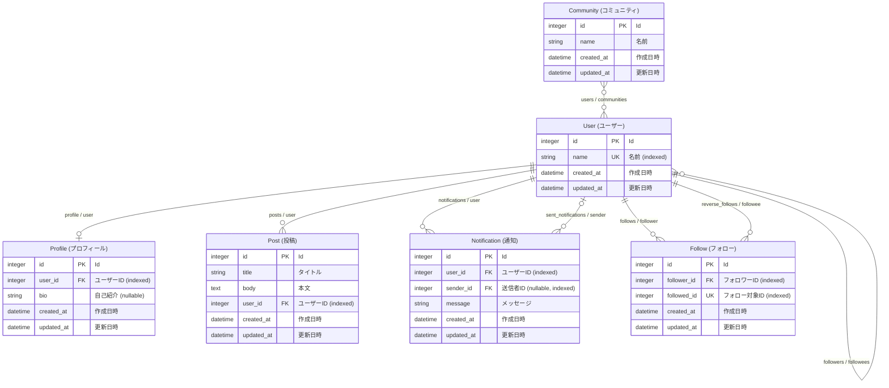

# Arerd

**Arerd** is a Ruby gem that extracts Entity-Relationship (ER) information from your ActiveRecord models and generates clear, visual ER diagrams in [Mermaid](https://mermaid-js.github.io/) format.

Once integrated into your Rails project, Arerd provides a convenient Rake task (`db:erd:mermaid` or `db:erd:markdown`) that outputs a Mermaid-formatted ER diagram directly to your terminal.

You can also automate ER diagram generation in your CI pipeline by outputting the diagram in Markdown format. This ensures your ER diagram documentation is always up to date and easy to maintain.

## Installation

Add Arerd to your Rails application's Gemfile:

```ruby
gem "arerd"
```

Then install the gem:

```shell
bundle install
```

## Usage

### Generate a Mermaid ER Diagram

Run the following command to create a Mermaid ER diagram:

```shell
bin/rails db:erd:mermaid
```

This will output the diagram in Mermaid's `erDiagram` format to standard output. You can copy and paste the result into the [Mermaid Live Editor](https://mermaid.live/) or any Mermaid-compatible tool to visualize your ER diagram.

### Generate a Markdown ER Diagram

To output the ER diagram in Markdown format:

```shell
bin/rails db:erd:markdown
```

This command prints the diagram wrapped in triple backticks and tagged as `mermaid`, allowing you to preview it directly in supported Markdown editors or viewers.

### Internationalization (I18n) Support

Table and column names in diagrams are automatically translated using your Rails application's locale files. Arerd leverages Rails' I18n system to provide localized names for entities and attributes, making diagrams more accessible for international teams.

### Notes

* **All associations must specify the `inverse_of` option.**
* Associations using `has_many :through` are ignored.
* Polymorphic associations (e.g., `belongs_to :taggable, polymorphic: true`) are not supported.

### Example Output


